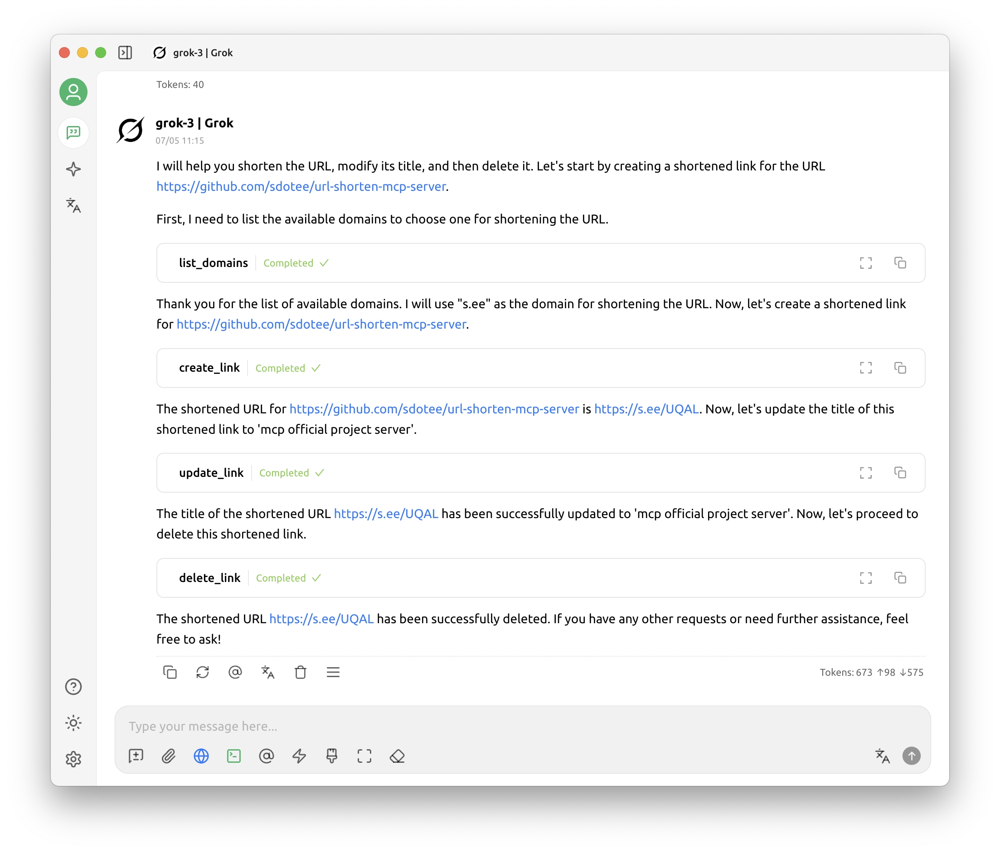

# See URL Shortener MCP Server

A Model Context Protocol (MCP) server for the See URL shortener service (s.ee). This server enables AI assistants to create, update, delete, and manage short URLs through the MCP protocol.



## 🚀 Features

- Create Short URLs: Generate shortened URLs with optional custom slugs
- Update URLs: Modify existing short URLs and their metadata
- Delete URLs: Remove short URLs from the service
- List Domains: View available domains for URL shortening
- Docker Support: Easy deployment with Docker and Docker Compose
- Environment Configuration: Flexible configuration through environment variables

## 📋 Prerequisites

- Node.js (v18 or higher)
- pnpm package manager
- Docker and Docker Compose (for containerized deployment)
- See URL shortener API key (from [s.ee](https://s.ee))

## 🛠️ Installation

### Option 1: Local Development Setup

1. Clone the repository
   ```bash
   git clone https://github.com/your-username/shorten-url-mcp-server.git
   cd shorten-url-mcp-server
   ```

2. Install dependencies
   ```bash
   pnpm install
   ```

3. Configure environment variables
   
   Create a `.env` file in the root directory:
   ```bash
   # Server configuration
   BIND_PORT=3000
   BIND_HOST=0.0.0.0
   
   # See URL shortener API configuration
   URL_SHORTENER_API_KEY=your_api_key_here
   URL_SHORTENER_API_BASE=https://s.ee
   URL_SHORTENER_DEFAULT_DOMAIN=s.ee
   ```

4. Start the server
   ```bash
   pnpm serve
   ```

### Option 2: Docker Deployment

1. Clone the repository
   ```bash
   git clone https://github.com/your-username/shorten-url-mcp-server.git
   cd shorten-url-mcp-server
   ```

2. Configure environment variables
   
   Edit the `compose.yaml` file and update the environment variables:
   ```yaml
   environment:
     BIND_PORT: "3000"
     BIND_HOST: "0.0.0.0"
     URL_SHORTENER_API_KEY: "your_api_key_here"
     URL_SHORTENER_API_BASE: "https://s.ee"
     URL_SHORTENER_DEFAULT_DOMAIN: "s.ee"
   ```

3. Start with Docker Compose
   ```bash
   docker-compose up -d
   ```

4. View logs
   ```bash
   docker-compose logs -f
   ```

## 🔧 Configuration

### Environment Variables

| Variable | Description | Default Value |
|----------|-------------|---------------|
| `BIND_PORT` | Port for the MCP server | `3000` |
| `BIND_HOST` | Host for the MCP server | `0.0.0.0` |
| `URL_SHORTENER_API_KEY` | API key for s.ee service | *Required* |
| `URL_SHORTENER_API_BASE` | Base URL for s.ee API | `https://s.ee` |
| `URL_SHORTENER_DEFAULT_DOMAIN` | Default domain for shortened URLs | `s.ee` |

## 🔨 Available Tools

The MCP server provides the following tools:

### 1. `create_link`
Creates a new short link on s.ee.

Parameters:
- `target_url` (string, required): The destination URL to shorten
- `domain` (string, required): The domain to use for the short link
- `slug` (string, optional): Custom slug for the short link
- `title` (string, optional): Title for the link

Example:
```json
{
  "target_url": "https://example.com/very-long-url",
  "domain": "s.ee",
  "slug": "my-custom-slug",
  "title": "My Example Link"
}
```

### 2. `update_link`
Updates an existing short link.

Parameters:
- `slug` (string, required): The slug of the link to update
- `target_url` (string, required): The new destination URL
- `domain` (string, required): The domain of the link
- `title` (string, optional): New title for the link

### 3. `delete_link`
Deletes an existing short link.

Parameters:
- `slug` (string, required): The slug of the link to delete
- `domain` (string, required): The domain of the link

### 4. `list_domains`
Lists all available domains for shortening links.

Parameters: None

## 🚀 Usage Examples

The server exposes an HTTP endpoint at `/mcp` that accepts MCP protocol requests:

```bash
curl -X POST http://localhost:3000/mcp \
  -H "Content-Type: application/json" \
  -d '{
    "jsonrpc": "2.0",
    "id": 1,
    "method": "tools/call",
    "params": {
      "name": "create_link",
      "arguments": {
        "target_url": "https://example.com",
        "domain": "s.ee"
      }
    }
  }'
```


## 🛡️ Security Considerations

- API Key Protection: Never commit your API key to version control
- Environment Variables: Use environment variables for sensitive configuration
- Network Security: Consider using HTTPS in production
- Rate Limiting: Be aware of API rate limits from the s.ee service


## 📝 API Reference

### MCP Protocol Endpoints

- `POST /mcp` - Handle MCP requests
- `GET /mcp` - Handle SSE streams (for session management)
- `DELETE /mcp` - Handle session termination

### See URL Shortener API

This server interfaces with the See URL shortener API. For more information about the API, visit [s.ee](https://s.ee).

## 📄 License

This project is licensed under the MIT License - see the [LICENSE](LICENSE) file for details.

## 🆘 Support

If you encounter any issues:

1. Check the [GitHub Issues](https://github.com/your-username/shorten-url-mcp-server/issues)
2. Review the server logs for error messages
3. Ensure your API key is valid and has the necessary permissions
4. Verify that the s.ee service is accessible from your network

## 📚 Resources

- [Model Context Protocol Documentation](https://modelcontextprotocol.io/)
- [See URL Shortener](https://s.ee)